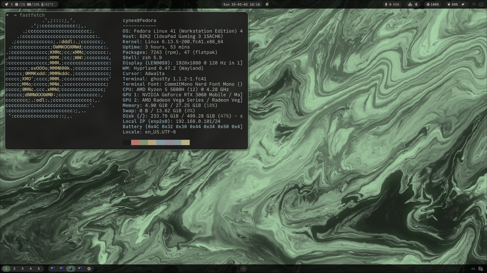
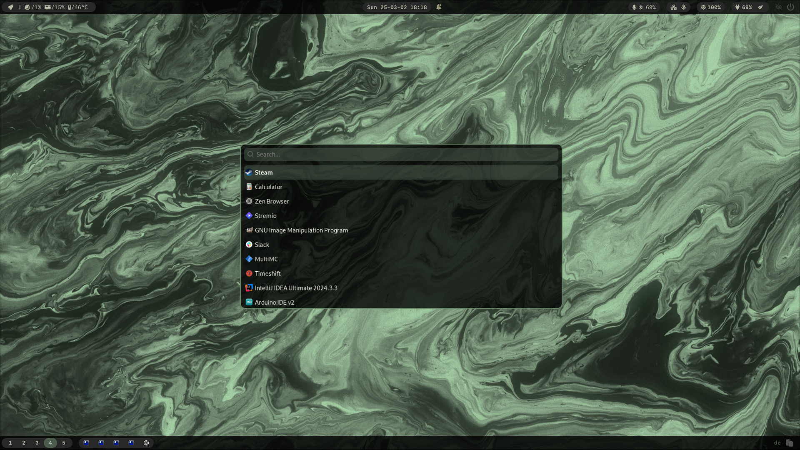
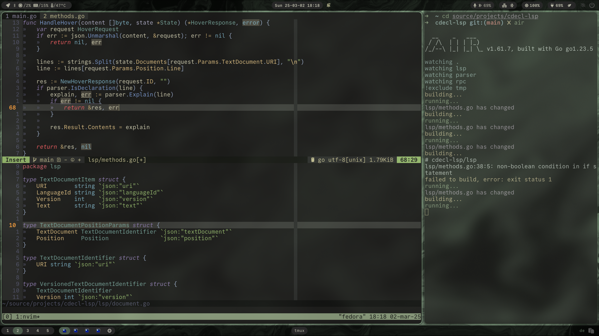

<h1>⚫ dotfiles</h1>

Personal Hyprland configuration

---
## Showcase

## Components
- Compistor/WM: [`hyprland`](https://github.com/hyprwm/Hyprland)
- Status Bar: [`waybar`](https://github.com/Alexays/Waybar)
- App Launch: [`wofi`](https://hg.sr.ht/~scoopta/wofi)
- Shell: `zsh` with [`oh-my-zsh`](https://github.com/ohmyzsh/ohmyzsh/)
- Terminal: [`ghostty`](https://github.com/ghostty-org/ghostty)
- Editor: [`neovim`](https://github.com/neovim/neovim)
- Notifications: [`swaync`](https://github.com/ErikReider/SwayNotificationCenter)
- Wallpaper setter: [`hyprpaper`](https://github.com/hyprwm/hyprpaper)

## Acknowledgements
`TODO`
