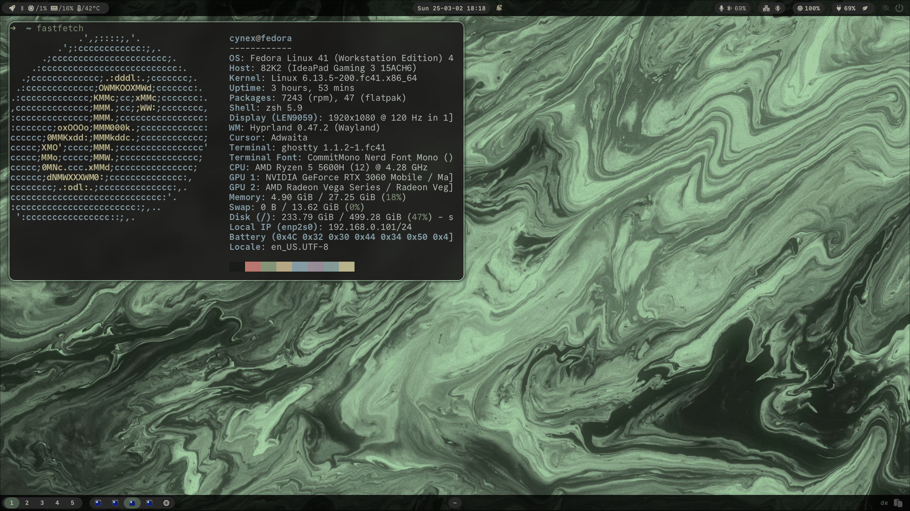
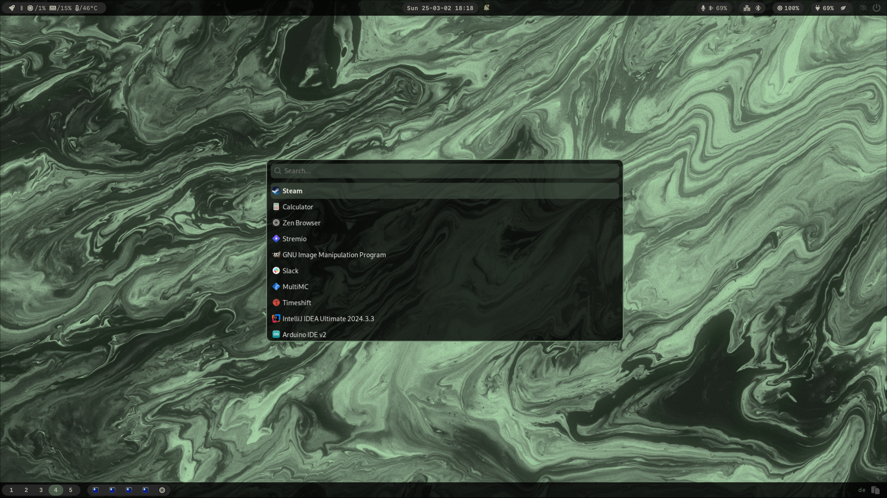
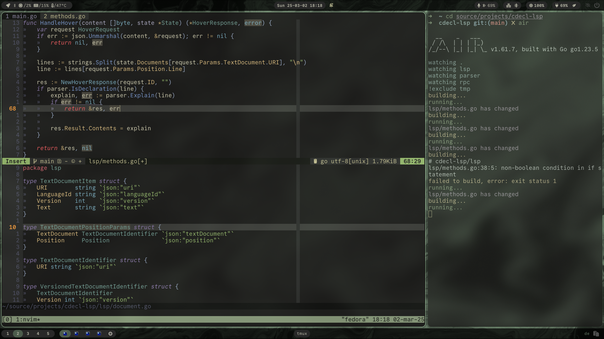

<div align="center">
<h1>⚫ dotfiles</h1>
<p>Personal Hyprland configuration</p>

</div>

---
## Showcase







## Components
- Compistor/WM: [`hyprland`](https://github.com/hyprwm/Hyprland)
- Status Bar: [`waybar`](https://github.com/Alexays/Waybar)
- App Launch: [`wofi`](https://hg.sr.ht/~scoopta/wofi)
- Shell: `zsh` with [`oh-my-zsh`](https://github.com/ohmyzsh/ohmyzsh/)
- Terminal: [`ghostty`](https://github.com/ghostty-org/ghostty)
- Editor: [`neovim`](https://github.com/neovim/neovim)
- Notifications: [`swaync`](https://github.com/ErikReider/SwayNotificationCenter)
- Wallpaper setter: [`hyprpaper`](https://github.com/hyprwm/hyprpaper)

## Installation
_Dear future me (probably),_

To install/recover these dotfiles:

0. Make sure `git` and `stow` are installed
1. ```
    git clone git@github.com:cynex0/dotfiles.git ~/dotfiles
    ```
2. ```
    cd ~/dotfiles
    stow .
    ```

## Acknowledgements
My desktop environment has been inspired by, and/or uses:
- [@IonelPopJara](https://github.com/IonelPopJara) and his [dotfiles](https://github.com/IonelPopJara/dotfiles)
- [ML4W Dotfiles for Hyprland](https://github.com/mylinuxforwork/dotfiles)
- [kickstart.nvim](https://github.com/nvim-lua/kickstart.nvim) and [kickstart-modular.nvim](https://github.com/dam9000/kickstart-modular.nvim?tab=readme-ov-file)
- [midnight](https://github.com/refact0r/midnight-discord/tree/master) discord theme
- [Stow has forever changed the way I manage my dotfiles](https://youtu.be/y6XCebnB9gs) (Youtube - Dreams of Autonomy)

`TODO:` find original wallpaper author
